# Architecture

PrivacySpec is a passive observation layer around ordinary Playwright tests. It provides an
automatic fixture, sanitized per-test attachment, reporter path, browser-side discovery of
high-confidence email, phone, and password controls, and passive network, console, and browser
storage sink collection plus deterministic in-memory source-to-sink correlation and the six scoped
technical rules PS1001–PS1006. It compares contextual review findings with an explicitly accepted
semantic baseline and resolves stable rule IDs against a local, source-traceable technical-control
and EU regulatory-relevance registry.

```mermaid
flowchart LR
  tests[Ordinary Playwright tests] --> browser[Chromium application journey]
  browser --> fixture[Automatic PrivacySpec fixture]
  fixture --> observers[Network, console, storage, and input observers]
  observers --> memory[Bounded test-scoped raw registries]
  memory --> correlate[Bounded deterministic correlation]
  correlate --> sanitize[Sanitized semantic flows]
  sanitize --> rules[Technical rules PS1001-PS1006]
  rules -. stable rule ID .-> mappings[Static control and EU relevance mappings]
  rules --> attachment[Sanitized per-test attachment]
  attachment --> reporter[PrivacySpec reporter]
  mappings --> explain[Explain CLI]
  mappings -. opt-in evidence profile .-> reporter
  reporter --> baseline[Semantic baseline comparison]
  baseline --> output[Terminal and JSON output]
  explain --> output
```

The workspace has two public boundaries:

- `examples/basic-playwright` provides a minimal ordinary Playwright integration.
- `packages/privacyspec` provides the fixture, input and sink observers, conservative source
  classifier, deterministic correlator, technical rule engine, semantic baseline, CLI, reporter,
  mapping registry, and terminal/JSON reporting.

Raw sensitive values may exist only transiently in browser or test-worker memory for correlation.
Persisted artifacts contain semantic flow information and never raw personal data, passwords, or
tokens. PrivacySpec remains local-only and has no telemetry or hosted service.

The input observer is installed with `BrowserContext.addInitScript()`. It captures
`input`/`change` events and streams each classified source through a context binding into a
bounded, test-scoped Node registry as it occurs. This preserves event sources across full
navigation and page or popup closure, while separate fixture instances and unguessable stream
tokens prevent values from crossing tests during parallel execution. A bounded browser buffer is
retained only for failed stream delivery. The page-visible state is frozen and exposes copied
snapshots rather than the mutable buffer. Observer scripts bind the native clock before application
code runs, so an application that mocks `Date.now()` cannot corrupt source/storage ordering.

At teardown, open documents are sampled for programmatic control updates that emitted no event,
and any buffered sources are merged into the same registry. Only strong HTML semantics are
classified at this stage. The worker recomputes source classification rather than trusting
page-provided category or evidence fields. Raw values are removed from every persisted metadata
field before the sanitized per-test attachment is created, and the in-memory registry is explicitly
cleared and disabled after each test attempt.

Network requests and browser console calls are collected from context-level Playwright events.
Request URLs, complete headers where promptly available, and bodies remain transient in the test
worker. JSON and form bodies are assigned structured locations, text bodies are bounded, multipart
collection records field metadata only, binary bodies are not parsed, and request bodies are capped
at 1 MiB. Request attribution is sampled synchronously when the event arrives. Retained network
material is also capped at 16 MiB and 10,000 material entries per test. Console argument traversal
is depth/node/size bounded in the browser before any serialized value crosses into the worker.
Console and storage registries have independent 16 MiB aggregate retention limits. Asynchronous
Playwright extraction has short fallbacks so observer teardown cannot hang a test.

`Storage.prototype.setItem` is wrapped without changing its native argument conversion, return,
name, or arity. Successful local/session storage changes stream to the test-scoped Node collector so
removed values and closed pages do not erase write evidence. Teardown also samples cookies and
local storage from context state plus local/session storage from open frames. IndexedDB is deferred.

At teardown, the correlator generates a bounded variant set once per discovered source and matches the
complete value representation against transient sink material. Supported representations are
exact text, semantically appropriate email case variants, URI/form encoding, UTF-8 Base64,
SHA-256, and lowercase-email SHA-256. This remains deterministic value correlation rather than
arbitrary JavaScript taint tracking. Semantic flow identity collapses repeated requests,
console-rendering duplicates, and storage write/snapshot duplicates while preserving distinct sink
locations and transforms. Event-observed sources only correlate with sinks captured at or after the
source event; final-state fallback sources remain eligible for the whole test because their teardown
timestamp does not indicate when the value first existed.

Correlation is capped at 1,000,000 candidate comparisons, 64 MiB of candidate bytes scanned, and
2,000 semantic flows per test. URL candidates are bounded to 8 KiB before parsing. Normalized paths
are processed segment-by-segment without allocating an array for the full input and stop at 2,048
characters with an explicit truncation marker. Parsed URL recipient, endpoint, and candidate
metadata is prepared once per sink. Reaching any safety bound produces a sanitized informational
diagnostic, which the reporter prints rather than silently discarding coverage.

Network recipients are classified against exact configured origins or explicitly configured exact
hosts. The Playwright `baseURL` origin is inferred as first-party by default; different ports,
hosts, IP spellings, and unlisted subdomains remain external. Final open-page URLs are sampled as a
bounded transient sink so persistent SPA `history.replaceState` flows are observable without
instrumenting application history APIs.

The attachment persists source/sink metadata and sanitized semantic `DataFlow` records: category,
confidence, transform, sink location, normalized endpoint, recipient boundary, and test
attribution. Matching values—including encoded, Base64, and hashed representations—are included in
the final redaction set and never persisted.

The rule engine evaluates only sanitized flows. PS1002, PS1003, and PS1006 are
high-confidence technical failures. PS1001 is contextual review for ordinary personal data in a URL
and an error-level technical failure for a high-confidence secret. PS1004 is contextual review for
personal data crossing the configured first-party boundary; PS1005 is contextual review for
personal data in browser storage and a critical technical failure only for a high-confidence
password. The current implementation has no session- or API-token classifier. HTTP transport checks
require an observed network request, so a URL created only through browser history is not mistaken
for a transmission.
Insecure local-development origins must be explicitly allowed. The reporter fails the run for
technical failures, while the default policy reports new `REVIEW_REQUIRED`
findings as non-failing warnings. Findings and per-test attachments remain technical, compact, and
sanitized.

An immutable local mapping registry keyed by the same stable rule IDs links each
rule to version-pinned OWASP ASVS 5.0.0 controls and contextual GDPR relevance from primary EUR-Lex
text. `privacyspec explain <rule-id>` renders the observation rule, relation strength, rationale,
applicability caveats, review dates, limitations, and sources. Mapping metadata is resolved from the
rule ID rather than duplicated into each finding or baseline, so wording/source updates cannot alter
flow identity. A separate reporter profile can show testing-evidence relevance for Commission
Implementing Regulation (EU) 2024/2690, Annex 6.5.2(b)–(c), only after explicit opt-in. It is
report-level supporting evidence and never a per-finding determination. The full source and wording
policy is in `docs/legal-mapping-policy.md`.

Baselines contain only `REVIEW_REQUIRED` personal-data flows, including PS1001 URL observations.
Objective technical failures cannot be accepted and continue to fail every run. A baseline identity
contains the rule, data category, sink, canonical recipient origin, normalized endpoint, structured
location, and transform. It deliberately excludes test file/title/project, request method, source
metadata, and any raw-value fingerprint. Numeric, UUID, and long hexadecimal route segments
normalize to `:number`, `:uuid`, and `:id`.

The reporter reads the committable `privacyspec-baseline.json` and writes the ignored,
mode-`0600` `.privacyspec/latest-run.json` handoff atomically. Accepted review flows are quiet;
unaccepted flows are `new`; accepted flows absent from a complete run are shown as `resolved`.
`privacyspec baseline update` is the only mutation path, requires confirmation (or explicit `--yes`
outside CI), and refuses incomplete, zero-execution, non-passing, coverage-limited, and CI runs. The
reporter invalidates the prior latest-run handoff before execution, so an interrupted process cannot
leave stale baseline-eligible output.
A filtered Playwright invocation can still make an accepted flow appear resolved because v0 does not
persist run-scope coverage; baseline replacement must therefore follow the full intended test scope,
and resolved status remains a candidate for human interpretation rather than proof that application
behavior was removed.

The latest-run handoff is single-writer in v0. Concurrent Playwright processes must use distinct
`latestRunPath` values, and baseline update must run only after the chosen process finishes; run
ownership/locking is deferred until real-pilot evidence shows it is needed.

PrivacySpec writes `privacyspec-report.json` atomically with mode `0600` and schema version 1. A report
contains tool/run versions, Playwright and PrivacySpec outcomes, project and test-attempt counts,
source-category and sink-kind aggregates, sanitized semantic flows, findings with test attribution,
new/known/not-baseline-eligible state, resolved baseline candidates, suite timing, cumulative test
duration, diagnostics, and the static mappings used by observed rules. It never includes collected
request bodies, console arguments, storage values, or raw source values. The previous report is
removed at run start so an interrupted run cannot leave a stale successful CI artifact.
Like the latest-run handoff, the JSON report is single-writer in v0; concurrent Playwright
processes or shards must use distinct `reportPath` values and aggregate them externally.

The reporter's final line distinguishes `PASS`, `REVIEW`, `FAIL`, and `INCOMPLETE` from the
functional Playwright result. Technical failures and integration/reporting failures override the
reporter status to fail CI; new contextual review findings remain non-failing under the default
policy unless `failOnNewReviewFindings` is enabled. A non-passing or coverage-limited Playwright run
is `INCOMPLETE` rather than evidence that accepted behavior was resolved. Actionable terminal
findings print their endpoint/location, OWASP control relationship, contextual GDPR provisions, and
authoritative source URLs. Benign flows are represented by an aggregate count rather than one line
per flow; their sanitized detail remains in JSON. SARIF is not emitted because runtime findings do
not yet have dependable source-code locations.

Actionable terminal findings are grouped by the same stable semantic dimensions used for
baseline comparison: rule, category, sink, recipient, normalized endpoint, structured location,
and transform. One human-facing line reports the occurrence count and up to three observing test
titles, while the JSON report deliberately preserves each sanitized occurrence for audit evidence.
This reduces first-run review noise without discarding test attribution or changing baseline
identity. It does not infer application root causes across different semantic endpoints.

The npm package allowlist contains compiled `dist/` output, the package README, and Apache-2.0
license; npm's mandatory package metadata is the only other permitted root addition. Source,
tests, fixtures, runtime reports, latest-run handoffs, and Playwright outputs are excluded.
