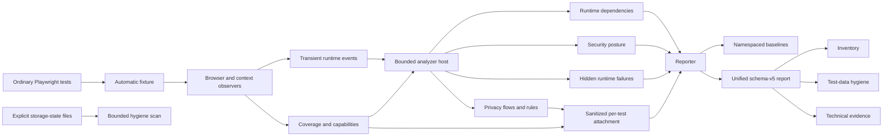

# Architecture

PrivacySpec is a passive observation and analysis layer around ordinary Playwright tests. One
automatic fixture collects bounded browser facts, dispatches normalized runtime events to
failure-isolated analyzers, and attaches sanitized per-test results. One reporter aggregates those
results, evaluates baselines, renders a secondary-coverage hierarchy, and writes strict local
artifacts.

## Workspace boundaries

- `packages/privacyspec` is the published fixture, reporter, analyzers, rules, baselines, report
  models, and CLI.
- `examples/basic-playwright` is a runnable public integration with an ordinary Playwright test.

All processing is local. PrivacySpec has no hosted service, telemetry, account, or runtime network
lookup. Raw sensitive values may exist only in bounded browser/test-worker memory; the complete
artifact contract is in [`privacy-design.md`](privacy-design.md).

## Per-test lifecycle

1. `withPrivacySpec()` composes an automatic test-scoped fixture with the project's existing
   Playwright `TestType`.
2. The fixture instruments the supported test-scoped `BrowserContext`, installs an init script,
   attaches context/page listeners, and creates coverage and analyzer state.
3. Input, request, response, console, storage, cookie, navigation, and page-error observations are
   normalized into an internal `RuntimeEvent` union. Events are dispatched directly; PrivacySpec
   does not retain a reportable raw event log.
4. When the test body ends, event intake freezes. One pending-work registry drains bounded network,
   console, optional response-body, fallback-source, and final-storage work within five seconds.
   Rejection or timeout produces a fixed sanitized diagnostic and an incomplete result.
5. An analyzer host dispatches events to at most eight analyzers and bounds outstanding async
   callbacks. One analyzer failure is isolated and cannot silently turn missing evidence into a
   pass.
6. Analyzers produce sanitized, canonical per-test results. The privacy result is attached to the
   Playwright attempt; namespaced analyzer results flow into reporter aggregation.
7. In ordinary single-process mode, the reporter combines attempts, coverage, baselines, and
   module outputs into terminal status, private JSON artifacts, and baseline-update handoffs. In
   explicit run-scope mode it emits only one sanitized baseline-ineligible process/shard part.
8. `privacyspec aggregate` establishes the complete expected part set before it performs one
   run-wide baseline comparison and writes the final report/latest-run handoffs.
9. Test-scoped raw registries, object references, listener maps, and transient redaction material
   are cleared.

Browser input and final-control sources correlate with matching sinks anywhere in the same isolated
test. This establishes co-observation, not proof that the input caused the sink; cross-process event
delivery is not treated as a causal clock. Response-discovered sources are stricter: a monotonic
worker sequence and transient request identity restrict them to later sinks and exclude their own
originating request.

## Observation and coverage

The init script captures strongly classified email, telephone, password, name, postal-address,
full birth-date, explicit account-identifier, payment-card, gender-identity, and job-title controls
through `input`/`change` events and bounded teardown sampling. Input, textarea, select, and
contenteditable controls share this path. Expanded categories require exact autocomplete intent or
corroborated exact machine/accessibility hints; gender identity and job title are
autocomplete-only. Card-number, full-expiry, and birth-date shapes are validated, and the existing
six-character source floor prevents ambiguous short substring correlation. The worker repeats
classification from bounded control metadata instead of trusting page-supplied evidence. It also
receives a normalized declarative table for configured custom DOM categories; the worker repeats
those exact matches and ignores browser-supplied category/confidence claims.

`Storage.prototype.setItem` is wrapped with native conversion and return behavior preserved.
Context listeners observe requests, responses, console calls, cookies, navigation, and page errors.
Optional first-party JSON response discovery is disabled by default and remains limited to bounded,
known-length JSON with recognized email/phone key and value semantics.

This is not a generalized source-classification engine. Custom IDs are bounded
`custom.personal.*` or `custom.secret.*` categories and can match only exact normalized metadata
already collected from DOM controls. There are no callbacks, regular expressions, selectors,
configured attributes, or custom response/storage/URL/JavaScript source adapters. Built-ins run
first, custom secrets require corroborated high confidence, and ambiguous custom matches admit no
source and make coverage partial. DOM-control and response-JSON classification remain separate;
browser storage, cookies, URLs, and runtime state are sinks rather than mined sources.

The composed worker-scoped `browser` fixture is wrapped with a behavior-preserving proxy. Calls to
`browser.newContext()` and `browser.newPage()` are detected but those independent contexts are not
instrumented. Supported runs receive one of four coverage states:

- `COMPLETE`: required capabilities and intended test scope were fully observed;
- `PARTIAL`: bounded skips or limits make some evidence inconclusive;
- `INCOMPLETE`: the test/run did not provide a complete analyzable scope;
- `UNSUPPORTED`: application pages used a detected context outside the supported instrumentation
  boundary.

Anything other than complete coverage prevents a clean secondary-analysis conclusion. Detected
unsupported contexts produce `COVERAGE_INCOMPATIBLE` and a failing reporter result. Browser
instances obtained outside the composed fixture cannot be detected reliably and remain an explicit
coverage limitation.

Chromium is the supported default engine. The test-scoped fixture reads Playwright's `browserName`.
Ungated Firefox/WebKit attempts skip PrivacySpec observers and report unsupported coverage; gated
attempts run the same stable Playwright observer pipeline with an experimental label and a
per-engine capability table. A narrow three-engine fixture—not the Chromium demo suite—controls
promotion of those capability states.

The composed test-scoped `request` fixture shares the automatic fixture's analyzer host. A proxy
wraps only the seven network methods and delegates once. Disabled observation records only that a
call occurred; enabled observation admits bounded explicit options and final response
URL/status/selected posture headers, never response bodies. API request events feed privacy sinks,
dependency `fetch/xhr`, security posture, and generic request/first-party-5xx failures. They never
create sensitive sources. Each detected call makes the API capability partial and the run
baseline-ineligible because Playwright cannot guarantee final wire headers, implicit
cookies/authentication, or every redirect hop.

Before any supported sensitive source appears, queryless static `GET`/`HEAD` traffic and narrowly
recognized Vite development-module traffic are counted but not retained as privacy sink material.
Arbitrary query-bearing traffic and all traffic after the first source remain eligible. Seen,
accepted, and filtered counts are reported so filtering cannot masquerade as observation.

## Analyzer modules

| Module / namespace | Input reduced to | Output and baseline behavior |
| --- | --- | --- |
| Privacy / `privacy` | Classified sensitive sources plus bounded URL, network, console, storage, cookie, and optional response material | Sanitized flows; PS1001–PS1006; known/new/resolved contextual reviews; objective technical failures remain unbaselineable. |
| Dependencies / `dependency` | Request origin, boundary, method, resource category, and bounded test references | External origin/script/iframe/API review changes with an independent schema-v1 baseline. |
| Security / `security` | Selected first-party response posture and auth-cookie attributes | Changed CSP, HSTS, `nosniff`, CORS, transport, and cookie posture after explicit baseline acceptance. |
| Runtime failures / `runtime-error` | Page errors, error-level console events, request failures, and first-party 5xx responses | Sanitized new/known/resolved failure identities; new uncaught page errors and first-party 5xx facts fail the reporter. |

Analyzer outputs are technical observations. Dependency recipients are not automatically untrusted;
posture changes are not automatically vulnerabilities; runtime failures do not establish impact or
root cause. Legal/control interpretation remains separate and follows
[`legal-mapping-policy.md`](legal-mapping-policy.md).

## Privacy correlation and stable identity

The privacy analyzer keeps bounded raw sources and sinks in memory, generates a bounded variant set
once per source, and matches exact text, semantic email case variants, URI/form encoding, UTF-8
Base64 containers, SHA-256, and normalized-email SHA-256. JSON/form/cookie locations are structured;
binary bodies are not parsed. Matching variants join the redaction set and are never persisted.

Semantic identity collapses repeated occurrences while preserving category, request surface,
boundary/recipient, sink, normalized endpoint, structured location, and transform. Endpoint canonicalization uses one
repository-independent lexical primitive across endpoint-bearing analyzers. Numeric, UUID, and
bounded generated-instance segments—including structured handles with an optional terminal
delimiter—normalize to stable markers while ordinary route vocabulary and representation suffixes
remain literal. This is deterministic normalization, not router inference or arbitrary taint
tracking.

Persistent collections use one locale-independent UTF-16 code-unit ordering contract. Producers
create canonical deep copies and strict readers reject duplicate or non-canonical input. Runtime
error identity is based on a bounded, normalized rendered first line and fixed summaries; raw
messages, stacks, request material, and structured arguments are excluded.

## Reporter, artifacts, and baselines

The terminal hierarchy reports, in order:

1. functional Playwright outcome;
2. observation coverage;
3. overall secondary-coverage outcome;
4. privacy, dependency, security, and runtime module outcomes;
5. bounded change counts and actionable details.

`FAIL` takes precedence over inconclusive coverage, then review, then pass. A module without
complete observation is `INCONCLUSIVE`, never a clean result.

The current unified JSON report is schema v5 with request surfaces, browser-engine/API coverage,
and namespaced `analysis.privacy`, `analysis.dependencies`, `analysis.security`, and
`analysis.runtimeErrors` sections. Strict readers accept report schemas v1–v5. Per-test privacy
attachments are schema v5, run parts are schema v3, and privacy baselines/latest-run handoffs are
schema v2. Inventory/evidence exports remain schema v2. Attachment v1–v4 and run-part v1/v2
classifier state is unavailable; legacy request surfaces default to `browser` only where the old
schema omitted them. Dependency/security/runtime analyzers, test-data, storage-state, and baseline
proposals retain their documented schema-v1 formats.

Baselines store semantic review identities, not observed values or test identities. Whole-baseline
update is explicit, refuses CI and incomplete/non-passing runs, and objective privacy technical
failures are not baseline-eligible. The runtime-failure namespace retains its independent existing
severity and baseline semantics. Resolved items are candidates for human interpretation; a
filtered run is not proof that an application behavior disappeared.

Selective review is a two-step local workflow. A read-only comparison creates an independent
schema-v1 proposal containing only canonical module/action/identity entries, fixed counts, source
snapshot digests, deterministic proposal IDs, and its own digest. Privacy, dependency, and runtime
identities have add/remove semantics; security targets can also change their canonical fingerprint
set. Acceptance rereads a strict complete latest-run handoff and the current accepted baseline,
re-derives the proposal, rejects stale or edited snapshots/selections, and atomically applies only
explicit IDs. Unselected accepted entries remain unchanged. Selective mutation and compatible
whole-snapshot update both refuse CI and require explicit confirmation; proposal creation never
mutates a baseline.

Reports, run parts, latest-run handoffs, baselines, baseline proposals, inventory, test-data, and
evidence outputs are written atomically with mode `0600`. Proposal/selective-acceptance workflow
paths reject symbolic-link components, collisions, non-regular files, and oversize input. Ordinary
unsharded runs retain the single-writer defaults.
Explicit `runScope` mode derives shard coordinates from Playwright or accepts a bounded process
coordinate and writes a create-only schema-v3 part under a run-specific directory. A detected
Playwright shard without `runScope` disables colliding final/latest outputs and fails closed.

Run-part v3 payloads are strict schema-v5 reports forced to `INCONCLUSIVE`: baseline states and module
change findings are absent and known/new/resolved counts are zero. Aggregation accepts at most 128
explicit files, requires one run/configuration ID, total, canonical project set, and policy across
all parts, requires identical classifier state in v3, and rejects duplicates, mixed versions, or
incompatible input. Missing coordinates produce a valid incomplete aggregate. Complete scope merges
privacy, dependency, security, runtime, functional, performance, test-data, and coverage facts
canonically and performs baseline comparison once.
Zero-test shards count as completed process contributions but do not manufacture observation.
Malformed/mismatched input is an integration error; valid `PASS`, `REVIEW`, `FAIL`, and
`INCONCLUSIVE` aggregates remain semantic results.

Legacy v1/report-v4 and v2/report-v5 parts remain readable with unavailable classifier state and
cannot create a complete privacy latest run. V1 also leaves engine/API capabilities unavailable.
Mixed v1/v2/v3 part sets are rejected. `runScope.configurationId` identifies the coordinated
execution/configuration envelope; it is distinct from the classifier table identity supplied to
the fixture.

## Safety bounds and blind spots

Collection and analysis bound source counts/value sizes, request bodies and retained bytes, console
serialization, storage, responses, URLs, pending work, analyzer state, correlation comparisons, and
output size. Hitting a relevant bound emits a sanitized diagnostic and makes the affected analysis
inconclusive or baseline-ineligible.

PrivacySpec does not observe backend-to-backend transfers, WebSocket payloads, deep service-worker
behavior, IndexedDB, or arbitrary JavaScript transformations. Experimental response discovery
does not read unknown-length, oversized, third-party, or non-JSON bodies and recognizes only email
and phone under conservative key/value semantics. DOM discovery does not recognize ordinary names
or addresses by value, generic identifiers, short field components, or API/session/JWT tokens.
The API-request experiment cannot observe `page.request`, `context.request`, or manually created
request contexts. Unclassified or unobserved data must never be reported as absent.

## Implementation map

- Integration and coverage: `packages/privacyspec/src/playwright/`
- Event model, capabilities, and analyzer host: `packages/privacyspec/src/runtime/`
- Module analyzers: `packages/privacyspec/src/analyzers/`
- Privacy discovery/observation/correlation: `packages/privacyspec/src/discovery/`, `observe/`,
  `correlate/`
- Rules and mappings: `packages/privacyspec/src/rules/`
- Report and baseline contracts: `packages/privacyspec/src/report/`, `baseline/`
- Human/machine exports: `packages/privacyspec/src/inventory/`, `testdata/`, `evidence/`, `cli/`

Use [`README.md`](README.md) to route from a task to the nearest tests and detailed contract.
