# Architecture

PrivacySpec is a passive observation layer around ordinary Playwright tests. Phase 26 uses the
internal runtime observer/analyzer boundary for privacy, dependency, browser security-posture, and
hidden runtime-failure analysis, then presents their results through one namespaced report and
terminal hierarchy. It retains the automatic fixture, sanitized per-test attachment, reporter
path, browser-side discovery of
high-confidence email, phone, and password controls, and passive network, console, and browser
storage sink collection plus deterministic in-memory source-to-sink correlation and the six scoped
technical rules PS1001–PS1006. It compares contextual review findings with an explicitly accepted
semantic baseline and resolves stable rule IDs against a local, source-traceable technical-control
and EU regulatory-relevance registry.

```mermaid
flowchart LR
  tests[Ordinary Playwright tests] --> browser[Chromium and application under test]
  browser --> fixture[Automatic PrivacySpec fixture]
  browser --> coverage[Coverage tracker and browser proxy]
  fixture --> observers[Request, response, console, storage, and input observers]
  observers --> events[Transient normalized runtime events]
  coverage --> capabilities[Runtime capability model]
  events --> host[Bounded failure-isolated analyzer host]
  capabilities --> host
  host --> privacy[Privacy analyzer]
  host --> dependencies[Dependency analyzer]
  host --> security[Security posture analyzer]
  host --> runtimeFailures[Runtime failure analyzer]
  privacy --> memory[Bounded test-scoped raw registries]
  dependencies --> depInventory[Bounded origin inventory]
  depInventory --> depBaseline[Namespaced dependency baseline]
  depBaseline --> depOutput[Bounded dependency review and schema-v1 artifact]
  security --> securityInventory[Selected first-party response fingerprints]
  securityInventory --> securityBaseline[Namespaced security baseline]
  securityBaseline --> securityOutput[Changed-posture reviews and schema-v1 artifact]
  runtimeFailures --> runtimeInventory[Bounded sanitized failure identities]
  runtimeInventory --> runtimeBaseline[Namespaced runtime-failure baseline]
  runtimeBaseline --> runtimeOutput[New, known, and resolved failures in schema-v1 artifact]
  memory --> hygiene[Transient browser-input email hygiene classification]
  memory --> correlate[Bounded deterministic correlation]
  correlate --> sanitize[Sanitized semantic flows]
  sanitize --> rules[Technical rules PS1001-PS1006]
  rules -. stable rule ID .-> mappings[Static control and EU relevance mappings]
  rules --> attachment[Sanitized per-test attachment]
  hygiene --> attachment
  attachment --> reporter[PrivacySpec reporter]
  dependencies --> reporter
  security --> reporter
  runtimeFailures --> reporter
  coverage --> attachment
  mappings --> explain[Explain CLI]
  mappings -. opt-in evidence profile .-> reporter
  reporter --> baseline[Semantic baseline comparison]
  baseline --> output[Unified hierarchy and schema-v4 JSON report]
  output --> inventory[Versioned runtime privacy inventory]
  output --> testdata[Versioned test-data hygiene review]
  output --> evidence[Versioned audit-supporting technical evidence]
  explicit[Explicit storage-state paths] --> stateScan[Bounded local hygiene scan]
  stateScan --> stateOutput[Sanitized structural evidence]
  mappings --> evidence
  explain --> output
```

The workspace has two boundaries:

- `examples/basic-playwright` provides a runnable integration with an ordinary Playwright test.
- `packages/privacyspec` provides the fixture, input and sink observers, conservative source
  classifier, internal runtime event/analyzer engine, privacy, dependency, and security-posture
  analyzers, hidden runtime-failure analyzer, deterministic correlator,
  technical rule engine, namespaced secondary-analysis report, semantic baseline, CLI, reporter,
  Phase 9 mapping registry, Phase 10 terminal/JSON reporting, Phase 16 runtime test-data hygiene,
  Phase 17 evidence export, the Phase 18 explicit storage-state hygiene pilot, and Phase 19
  observation-coverage integrity.

Raw sensitive values may exist only transiently in browser or test-worker memory for correlation
and hygiene classification. Persisted artifacts contain semantic flow or hygiene information and
never raw personal data, passwords, observed email domains, or tokens. PrivacySpec remains
local-only and has no telemetry or hosted service.

The Phase 4 input observer is installed with `BrowserContext.addInitScript()`. It captures
`input`/`change` events and streams each classified source through a context binding into a
bounded, test-scoped Node registry as it occurs. This preserves event sources across full
navigation and page or popup closure, while separate fixture instances and unguessable stream
tokens prevent values from crossing tests during parallel execution. A bounded browser buffer is
retained only for failed stream delivery. The page-visible state is frozen and exposes copied
snapshots rather than the mutable buffer. Observer scripts bind the native clock before application
code runs, so an application that mocks `Date.now()` cannot corrupt buffered fallback evidence.
Successfully streamed input and storage events retain the native browser timestamp captured when
the operation occurred. Browser-to-worker delivery order is not used as a causal clock: in keeping
with collect-first, correlate-after-test architecture, a control value may correlate with the same
value observed anywhere in its isolated test. The result reports co-observation, not proof that the
input caused the sink. Response sources and live request, console, and storage-write sinks use a
monotonic per-test worker event sequence. A transient per-test request identity also links a response
to its originating request so that request is excluded exactly. Neither sequence nor identity is
persisted. Response sources remain eligible only for later sinks.

The fixture counts every page emitted by its test-scoped context, including pages closed before
teardown. It also wraps the composed worker-scoped `browser` fixture with a behavior-preserving
proxy that detects calls to `browser.newContext()` and `browser.newPage()`. Each test attachment
records counts only: browser objects; observed/instrumented contexts and pages; storage-capable
pages; and top-frame navigation, request, and console events. Context/page listeners are removed at
teardown.

The proxy does not instrument independently created contexts in Phase 19. Instead, any observed
context or page outside the supported test-scoped context makes coverage `UNSUPPORTED`, produces a
sanitized `COVERAGE_UNSUPPORTED_CONTEXT` diagnostic, invalidates baseline eligibility, and fails
the reporter with `COVERAGE_INCOMPATIBLE`. This applies to both all-custom and mixed suites. A
missing current attachment, a non-passing/incomplete scope, meaningful browser tests with no page,
or a multi-test page workload with no navigation/network/console events is `INCOMPLETE`. Bounded
observer/correlation limits and optional response-observer skips are `PARTIAL`; otherwise coverage
is `COMPLETE`. Browser instances launched independently of the composed worker fixture, or custom
contexts created and closed before any active test-scoped tracker can observe them, remain outside
the detection guarantee.

At teardown, open documents are sampled for programmatic control updates that emitted no event,
and any buffered sources are merged into the same registry. Only strong HTML semantics are
classified at this stage. The worker recomputes source classification rather than trusting
page-provided category or evidence fields. Raw values are removed from every persisted metadata
field before the sanitized per-test attachment is created, and the in-memory registry is explicitly
cleared and disabled after each test attempt.

Network requests and browser console calls are collected from context-level Playwright events.
Request URLs, complete headers where promptly available, and bodies remain transient in the test
worker. JSON and form bodies are assigned structured locations, text bodies are bounded, multipart
collection records field metadata only, binary bodies are not parsed, and request bodies are capped
at 1 MiB. Request attribution is sampled synchronously when the event arrives. Retained network
material is also capped at 16 MiB and 10,000 material entries per test. Console argument traversal
is depth/node/size bounded in the browser before any serialized value crosses into the worker.
Console and storage registries have independent 16 MiB aggregate retention limits. Asynchronous
Playwright extraction has short fallbacks so observer teardown cannot hang a test.

Before a test has produced any supported sensitive source, queryless HTTP(S) `GET`/`HEAD` requests
for Playwright's static resource types are counted but not retained. Narrowly recognized Vite
development-module signatures are also filtered: dependency cache tokens, worker/import module
flags, and Svelte style-module requests. Arbitrary query-bearing requests and all traffic after the
first source remain eligible, and the aggregate seen/accepted/filtered counts are persisted in the
report and surfaced in the terminal when filtering occurred. This bounded early
filter reduces source-free asset-heavy runs without raising a sink cap or treating the discarded
traffic as proof of absence. A sensitive value present only in an unsupported source before such a
request remains outside PrivacySpec's coverage.

`Storage.prototype.setItem` is wrapped without changing its native argument conversion, return,
name, or arity. Successful local/session storage changes stream to the test-scoped Node collector so
removed values and closed pages do not erase write evidence. Teardown also samples cookies and
local storage from context state plus local/session storage from open frames. IndexedDB is deferred.

At teardown, Phase 6 generates a bounded variant set once per discovered source and matches the
complete value representation against transient sink material. Supported representations are
exact text, semantically appropriate email case variants, URI/form encoding, UTF-8 Base64,
bounded UTF-8 decoding of Base64/Base64url containers, SHA-256, and lowercase-email SHA-256.
Container decoding makes matches independent of the encoded value's byte alignment inside a larger
JSON/token value. Candidate strings are decoded once per test, accept only canonical bounded tokens,
and remain transient. This remains deterministic value correlation rather than
arbitrary JavaScript taint tracking. Semantic flow identity collapses repeated requests,
console-rendering duplicates, and storage write/snapshot duplicates while preserving distinct sink
locations and transforms. Request cookies are split into bounded per-cookie locations. Ambient
cookie propagation is identified by test, recipient origin, cookie name, and transform rather than
by every request method and asset endpoint, so one response-origin cookie does not fan out into an
inventory row per static resource. Event-observed and final-state control sources are eligible for
the whole isolated test because cross-process delivery order is nondeterministic and fallback
teardown timestamps do not indicate when a value first existed. Response-discovered sources retain
strict later-sink ordering.

Correlation is capped at 1,000,000 candidate comparisons, 64 MiB of candidate bytes scanned, and
2,000 semantic flows per test. URL candidates are bounded to 8 KiB before parsing. Normalized paths
are processed segment-by-segment without allocating an array for the full input and stop at 2,048
characters with an explicit truncation marker. Parsed URL recipient, endpoint, and candidate
metadata is prepared once per sink. Reaching any safety bound produces a sanitized informational
diagnostic, which the reporter prints rather than silently discarding coverage.

Network recipients are classified against exact configured origins or explicitly configured exact
hosts. The Playwright `baseURL` origin is inferred as first-party by default; different ports,
hosts, IP spellings, and unlisted subdomains remain external. Final open-page URLs are sampled as a
bounded transient sink so persistent SPA `history.replaceState` flows are observable without
instrumenting application history APIs.

The attachment persists source/sink metadata and sanitized semantic `DataFlow` records: category,
confidence, transform, sink location, normalized endpoint, recipient boundary, and test
attribution. Matching values—including encoded, Base64, and hashed representations—are included in
the final redaction set and never persisted.

The Phase 7 rule engine evaluates only sanitized flows. PS1002, PS1003, and PS1006 are
high-confidence technical failures. PS1001 is contextual review for ordinary personal data in a URL
and an error-level technical failure for a high-confidence secret. PS1004 is contextual review for
personal data crossing the configured first-party boundary; PS1005 is contextual review for
personal data in browser storage and a critical technical failure only for a high-confidence
password. The current implementation has no session- or API-token classifier. HTTP transport checks
require an observed network request, so a URL created only through browser history is not mistaken
for a transmission.
Insecure local-development origins must be explicitly allowed; the demo allows its application and
fake analytics origins while leaving the dedicated insecure receiver untrusted. The reporter fails
the run for technical failures, while the selected Phase 8 policy reports new `REVIEW_REQUIRED`
findings as non-failing warnings. Findings and per-test attachments remain technical, compact, and
sanitized.

Phase 9 adds an immutable local mapping registry keyed by the same stable rule IDs. It links each
rule to version-pinned OWASP ASVS 5.0.0 controls and contextual GDPR relevance from primary EUR-Lex
text. `privacyspec explain <rule-id>` renders the observation rule, relation strength, rationale,
applicability caveats, review dates, limitations, and sources. Mapping metadata is resolved from the
rule ID rather than duplicated into each finding or baseline, so wording/source updates cannot alter
flow identity. A separate reporter profile can show testing-evidence relevance for Commission
Implementing Regulation (EU) 2024/2690, Annex 6.5.2(b)–(c), only after explicit opt-in. It is
report-level supporting evidence and never a per-finding determination. The full source and wording
policy is in `docs/legal-mapping-policy.md`.

Phase 8 baselines only `REVIEW_REQUIRED` personal-data flows, including PS1001 URL observations.
Objective technical failures cannot be accepted and continue to fail every run. A baseline identity
contains the rule, data category, sink, canonical recipient origin, normalized endpoint, structured
location, and transform. It deliberately excludes test file/title/project, request method, source
metadata, and any raw-value fingerprint.

Every endpoint-bearing analyzer uses one repository-independent canonicalization primitive before
constructing a semantic identity. Numeric and UUID segments retain the descriptive `:number` and
`:uuid` markers. Long hexadecimal, mixed-case URL-safe, lowercase opaque alphanumeric, and bounded
random-prefix composite instance segments normalize to `:id`. A representation suffix such as
`.data` or `.json` remains part of the identity, and ordinary static route vocabulary remains
literal. These bounded lexical rules do not infer an application router: unusual static segments
that look exactly like generated instance identifiers can still be conservatively collapsed.

The reporter reads the committable `privacyspec-baseline.json` and writes the ignored,
mode-`0600` `.privacyspec/latest-run.json` handoff atomically. Accepted review flows are quiet;
unaccepted flows are `new`; accepted flows absent from a complete run are shown as `resolved`.
`privacyspec baseline update` is the only mutation path, requires confirmation (or explicit `--yes`
outside CI), and refuses incomplete, zero-execution, non-passing, coverage-limited, and CI runs. The
reporter invalidates the prior latest-run handoff before execution, so an interrupted process cannot
leave stale baseline-eligible output.
A filtered Playwright invocation can still make an accepted flow appear resolved because v0 does not
persist run-scope coverage; baseline replacement must therefore follow the full intended test scope,
and resolved status remains a candidate for human interpretation rather than proof that application
behavior was removed.

The latest-run handoff is single-writer in v0. Concurrent Playwright processes must use distinct
`latestRunPath` values, and baseline update must run only after the chosen process finishes; run
ownership/locking is deferred until real-pilot evidence shows it is needed.

Phase 10 writes `privacyspec-report.json` atomically with mode `0600` and schema version 1. A report
contains tool/run versions, Playwright and PrivacySpec outcomes, project and test-attempt counts,
source-category and sink-kind aggregates, sanitized semantic flows, findings with test attribution,
new/known/not-baseline-eligible state, resolved baseline candidates, suite timing, cumulative test
duration, diagnostics, and the static mappings used by observed rules. It never includes collected
request bodies, console arguments, storage values, or raw source values. The previous report is
removed at run start so an interrupted run cannot leave a stale successful CI artifact.
Like the latest-run handoff, the JSON report is single-writer in v0; concurrent Playwright
processes or shards must use distinct `reportPath` values and aggregate them externally.

The reporter's final line distinguishes `PASS`, `REVIEW`, `FAIL`, and `INCOMPLETE` from the
functional Playwright result. Technical failures and integration/reporting failures override the
reporter status to fail CI; new contextual review findings remain non-failing under the Phase 8
policy unless `failOnNewReviewFindings` is enabled. A non-passing or coverage-limited Playwright run
is `INCOMPLETE` rather than evidence that accepted behavior was resolved. Actionable terminal
findings print their endpoint/location, OWASP control relationship, contextual GDPR provisions, and
authoritative source URLs. Benign flows are represented by an aggregate count rather than one line
per flow; their sanitized detail remains in JSON. SARIF is deferred because Phase 10 makes it
optional and runtime findings do not yet have dependable source-code locations.

Phase 13 groups actionable terminal findings by the same stable semantic dimensions used for
baseline comparison: rule, category, sink, recipient, normalized endpoint, structured location,
and transform. One human-facing line reports the occurrence count and up to three observing test
titles, while the JSON report deliberately preserves each sanitized occurrence for audit evidence.
This reduces first-run review noise without discarding test attribution or changing baseline
identity. It does not infer application root causes across different semantic endpoints.

Phase 14 adds a bounded schema-v1 reader and derives `inventorySchemaVersion: 1` from the current
JSON report. Inventory aggregation keys are category, boundary, sink, recipient, method, normalized
endpoint, and structured location. Occurrences, source kinds/confidences, transforms, and observing
tests are collected under that identity. The export deliberately remains a current-run snapshot:
it does not introduce retained history, a second policy file, or legal approval state. Incomplete
reports remain useful for troubleshooting but suppress resolved-baseline output and prominently
state that absence is inconclusive.

Phase 15 adds an experimental response observer behind
`sources.firstPartyJsonResponses: true`. It applies the existing exact first-party origin/host
classifier before reading a body, requires a JSON media type and known content length, and caps
each response at 256 KiB and cumulative retained response material at 2 MiB per test. A four-worker
queue, bounded backlog/response count, and bounded JSON depth/node/value/source traversal constrain
asynchronous work. Unknown-length, oversized, invalid, and limited responses are skipped and
represented only by aggregate coverage counts.

Only valid email and phone values beneath recognized JSON-key semantics enter the transient source
registry. Passwords, names, addresses, generic identifiers, and arbitrary strings are excluded.
Response sources receive a monotonic sequence when Playwright emits the response event, before
bounded body parsing, and correlate only to later event sinks. Final storage snapshots are eligible
regardless of their browser timestamp because they are collected at teardown after the journey.
This preserves causal ordering for live events without treating browser and worker clocks as
equivalent.
If asynchronous parsing discovers the same raw value and provenance more than once, the registry
retains the earliest response-event timestamp rather than whichever body finishes first.
Their persisted provenance is limited to normalized source origin, endpoint, and JSON location;
the body buffer is cleared after processing and no response body is attached or reported.

New attachments and JSON reports use schema v2. The report adds experimental response-source
coverage, while data flows may add response provenance. Strict readers continue to accept report
schema v1, and baseline schema v1 deliberately ignores source provenance so its keys and lifecycle
remain unchanged. Inventory stays independently versioned at `inventorySchemaVersion: 1`.

New baseline-eligible flows are compared with accepted semantic identities in a fixed sequence:
recipient, category, endpoint, location, then transform. This yields stable explanatory labels
without changing the schema-v1 key. `KNOWN_REVIEW` means only that the same semantic review identity
was previously accepted into the technical baseline; it is not legal or organisational approval.

Phase 16 classifies only already-observed browser-control email sources while their raw values are
still in test-worker memory. It recognizes IANA-reserved example/special-use domains and up to 100
suite-configured synthetic email domains. Configuration and observed domains are Unicode/IDNA-
normalized only for the transient comparison; a configured domain matches itself and subdomains.
No DNS or network lookup occurs. Other categories and response-origin sources are outside this
phase's runtime scope; unsupported email shapes are recorded only as `UNASSESSED`.

Each classification becomes `SYNTHETIC`, `REVIEW_REQUIRED`, or `UNASSESSED`. The sanitized
attachment and schema-v2 report retain only the verdict, reason signal, category, source kind, and
test/control attribution. Neither the observed value nor its domain is persisted, including in
test labels after redaction. The reporter deduplicates these semantic observations across attempts,
prints only a one-line command hint when reviews exist, and never lets hygiene change the functional
or PrivacySpec result.

`privacyspec testdata` derives an independently versioned `testDataSchemaVersion: 1` review from a
report and renders terminal, JSON, or Markdown. Earlier reports remain readable with an explicit
unavailable-data limitation, and incomplete runs cannot imply verified absence. Output files use
the same atomic mode-`0600` writer as other runtime evidence. The wording follows the BfDI's June
2025 test-data guidance while keeping the observation technical: a non-recognized domain is a
review prompt, not evidence that a person or externally routable mailbox exists.

Phase 17 derives `evidenceSchemaVersion: 1` from a bounded schema-v1/v2 report. The independent
model aggregates observed categories, external recipients, rule occurrences, technical failures,
baseline states, hygiene totals, project/test scope, response coverage, and explicitly supplied
build identifiers. It reconstructs mapping records through a fixed field allowlist and preserves
their caveats and sources. It never reads Git/environment metadata and adds no upload, connector,
signature, retained history, or telemetry path.

Markdown presents observed technical facts first, then coverage, technical-control relevance,
regulatory relevance, and legal/evidence limitations. An incomplete source run retains present
observations but uses a prominent marker and an inconclusive/null resolved count, because a partial
run cannot support missing-flow conclusions. JSON uses the same separation. Both formats are
labelled audit-supporting technical evidence and do not express an audit opinion or legal status.

Phase 18's `testdata scan` path is independent of Playwright runtime observation and report schema.
It accepts one or more explicit regular files, rejects symlink components, enforces 1 MiB per-file
and depth-12/50,000-node JSON bounds, and inspects only Playwright cookie/origin/localStorage
structure. Local Git commands classify each input as tracked, ignored, untracked, or unavailable.
No repository enumeration occurs. Raw buffers are overwritten after classification, parsed state is
released, and the independent schema-v1 output uses input indexes rather than paths while retaining
only structural and heuristic counts. Review status is a hygiene prompt rather than evidence of
exposure or legal status. Playwright's authentication-state warning is the technical basis.

The npm package allowlist contains compiled `dist/` output, the package README, and Apache-2.0
license; npm's mandatory package metadata is the only other permitted root addition. Source,
tests, fixtures, runtime reports, latest-run handoffs, and Playwright outputs are excluded. The
package manifest identifies the released `0.1.0-beta.2` public beta. Any later publication or npm
dist-tag change remains an explicit release action.

Phase 19 advances new per-test attachments and JSON reports to schema v3. Report schema v3 adds the
stable observation coverage model and aggregated counters without changing semantic flows,
findings, rule IDs, baseline schema v1, or independent inventory/test-data/evidence schemas. Strict
readers continue to accept report schemas v1 and v2, expose a dedicated v3 parser, and reject
malformed or internally inconsistent counter shapes. The reporter likewise accepts attachment
schemas v1 and v2 for compatibility; because those attachments cannot provide Phase 19 counters,
their runs are conservatively `INCOMPLETE` rather than treated as conclusive.

Phase 20 freezes browser event intake when the test body finishes, then uses one internal per-test
pending-work registry to finalize network, console, optional response, fallback-source, and final
storage work. The drain has a fixed five-second bound. A rejected task or timeout emits only a
fixed, sanitized diagnostic and makes observation coverage `INCOMPLETE`; analysis never treats the
partial event set as clean. Completed work is snapshotted before transient registries are disposed.
The existing monotonic per-test sequence remains the ordering authority for response, request,
console, and storage-write events.

Phase 21 separates request counters from retained sink material and filters only narrowly defined
low-value static requests before a supported sensitive source exists. It preserves aggregate
seen/accepted/filtered coverage, the existing sink/material/correlation bounds, and fail-closed
coverage when any genuine limit is reached. Ambient cookie propagation is reduced semantically
without changing the privacy signal.

Phase 22 routes the supported fixture through an internal `RuntimeEvent` union. Every event has one
test ID and project name, stable attempt-scoped context/page IDs where the Playwright object is
known, a worker timestamp, and a monotonically increasing per-test sequence ID. Request, response,
console, storage, cookie, source, context, page, navigation, and final-page-URL events use this
model. Page-error events are modelled but remain an unavailable capability; Phase 22 does not start
the later runtime-failure analyzer. Existing request identities and event-time ordering remain the
correlation authority, and neither identities nor runtime-event metadata is persisted.

Events are dispatched directly to analyzers and are not accumulated as a reportable event log. The
host accepts at most eight analyzers and 1,024 outstanding asynchronous analyzer callbacks. Its
pending work drains inside Phase 20's existing five-second per-test finalization bound. A failure is
contained to its analyzer and represented without exception text; a privacy-analyzer failure emits
the fixed `PS_ANALYZER_PRIVACY_FAILED` diagnostic and makes observation coverage inconclusive.
Analyzer contexts expose capability state and sanitized test metadata but no artifact writer.

The internal capability model covers network, responses, console, storage, cookies, page errors,
custom contexts, response bodies, and sensitive sources with `complete`, `partial`, `incomplete`,
`unsupported`, or `disabled` state. The privacy analyzer declares network, console, storage,
cookies, custom-context, and source coverage as required; response-origin discovery remains
optional and default-off. This model is internal in Phase 22 and does not change attachment/report
schema v3 or the Phase 19 coverage counters.

The privacy analyzer now owns the bounded sensitive-source and sink registries, correlation,
test-data hygiene derivation, and PS1001–PS1006 evaluation. Internal semantic ownership is
namespaced as `privacy`, while persisted baseline keys deliberately remain the unchanged privacy
schema-v1 identities. Public `withPrivacySpec(...)`, reporter configuration, CLI commands,
attachment/report readers v1–v3, and inventory/test-data/evidence models are unchanged. There is no
dependency product signal in the Phase 22 compatibility boundary.

Phase 23 adds the first non-privacy analyzer under the internal module ID and baseline namespace
`dependency`. It consumes request metadata from the same transient event stream, including
metadata-only events for low-value static requests that Phase 21 deliberately excludes from privacy
sink retention. Those events contain request URL, method, browser resource type, frame kind, and
event metadata; the dependency analyzer immediately reduces them to origin, host, first-party or
external boundary, normalized resource category, method, occurrence count, and a bounded test-file
reference. Paths, queries, headers, bodies, credentials, test IDs, event timestamps, and raw events
are not included in dependency output.

Dependency resource categories are `script`, `stylesheet`, `font`, `image`, `fetch/xhr`, `iframe`,
`websocket`, and `other`. Main-frame document requests infer one application origin only when no
first-party origin or host is configured; explicit configuration remains authoritative. Each test
accepts at most 10,000 request events and 512 origins, with bounded method/test-reference sets. A
limit makes dependency coverage `PARTIAL`; missing, failed, timed-out, or unsupported observation
makes it inconclusive and suppresses resolved conclusions.

Suite aggregation compares external semantic identities such as
`dependency:external-script|cdn.vendor.test` and `dependency:external-api|api.vendor.test`, rather
than individual URLs. `NEW_EXTERNAL_ORIGIN`, `NEW_EXTERNAL_SCRIPT`, `NEW_EXTERNAL_IFRAME`, and
`NEW_EXTERNAL_API` are review-required technical changes. They do not label an origin malicious,
untrusted, compromised, or legally non-compliant, and they do not fail a functional run by default.
Terminal output is capped at 20 dependency findings while the sanitized dependency report retains
the bounded inventory.

Dependency state uses separate schema-v1 baseline, latest-run, attachment, and report models. The
baseline acceptance guard is available through `privacyspec baseline show|update --module
dependencies`; CI mutation remains disabled and incomplete latest runs cannot be accepted. Privacy
baseline schema v1, privacy attachment/report schemas v1–v3, `withPrivacySpec(...)`, PS1001–PS1006,
and existing privacy CLI behavior are unchanged. Cross-module unified reporting remains Phase 26
scope.

Phase 24 adds the internal `security` analyzer and a required `response-headers` capability. A
bounded observer reads response headers for at most 2,048 responses per test, but emits posture
events only for documents, first-party fetch/XHR responses, or responses with an objectively
auth-like cookie name. It retains only the selected CSP, HSTS, `X-Content-Type-Options`, and CORS
header values until the analyzer reduces them. Final browser cookie state contributes only the
cookie name plus `Secure`, `HttpOnly`, and `SameSite`; cookie values are never copied into the
security event or artifact.

The analyzer admits only configured first-party responses, or the first main-frame origin when no
configuration exists. It normalizes each target to host, route, method, and document/API/
authentication kind. CSP nonces and hashes are normalized before a truncated SHA-256 fingerprint
is retained; HSTS, `nosniff`, CORS, transport, and auth-cookie attributes become bounded semantic
strings. Query strings, raw header values, cookie values, status payloads, credentials, and raw
events are not persisted. Per-test state is capped at 512 targets and eight variants per target;
suite aggregation is capped at 10,000 targets and 20 test references.

Security posture is deliberately change-oriented. A target first appears as an acceptance
candidate without a missing-header finding. After acceptance, changes produce only
`REVIEW_REQUIRED` findings for CSP, HSTS, `X-Content-Type-Options`, CORS, auth-cookie attributes, or
transport. Findings map to pinned OWASP ASVS 5.0.0 V3 controls, with direct or contextual
relationships, and make no vulnerability or legal conclusion. Terminal findings are capped at 20.

Security state uses independent schema-v1 baseline, latest-run, attachment, and report files and
the guarded `privacyspec baseline show|update --module security` lifecycle. Partial, unsupported,
failed, or timed-out response/cookie observation makes the module inconclusive and suppresses
resolved targets. Privacy baseline schema v1, privacy attachment/report readers v1-v3,
PS1001-PS1006, dependency identities, and `withPrivacySpec(...)` remain unchanged.

Phase 25 adds the internal `runtime-failure` analyzer and makes the existing `page-errors`
capability available on supported instrumented pages. The fixture listens for page `pageerror`,
context `requestfailed`, and context `response` events and reuses the bounded console stream. It
emits lightweight request-failure and HTTP-response events into the same transient analyzer host;
no raw runtime-event log is created. Event listeners are detached at the test-body boundary before
the existing bounded finalizer runs.

The analyzer detects uncaught page errors, console messages at the `error` level, HTTP(S) request
failures, and configured/inferred first-party HTTP 500–599 responses. HTTP 4xx responses are not a
Phase 25 signal. Chromium console messages that only mirror an observed failed request or HTTP
status are suppressed in favor of the more stable network identity. This prevents the same
underlying network failure from becoming both a console and network finding.

Routes use the shared endpoint canonicalizer, so numeric, UUID, long-hex, high-entropy, lowercase
opaque, bounded random-prefix composite, oversized, email-shaped, and phone-shaped path segments do
not enter the semantic identity. Static route vocabulary and representation suffixes remain
distinct. Page and console
messages are never persisted: volatile URLs, email shapes, UUIDs, long hexadecimal values,
timestamps, and numbers are normalized transiently and reduced to a truncated SHA-256 structural
signature. Persisted summaries are fixed strings such as `Uncaught TypeError`, `Browser console
error`, `Network request failed`, and `First-party HTTP 503`. Browser failure codes are accepted
only from a bounded `ERR_*` grammar; query strings, raw messages, stack traces, request/response
bodies, and raw events are excluded.

Runtime-failure identities use the independent `runtime-error` namespace and schema-v1 baseline,
latest-run, attachment, and report files. A complete run compares all bounded identities as new,
known, or resolved. Known failures are quiet. New uncaught page errors and first-party 5xx
responses are `ERROR` / `TECHNICAL_FAILURE` and fail the reporter even when Playwright's functional
result is green. New console errors and request failures are `REVIEW` / `REVIEW_REQUIRED` and do
not fail by default. Non-passing or coverage-incomplete Playwright runs suppress runtime findings
and resolved conclusions, which avoids echoing failures Playwright already reports. The guarded
acceptance lifecycle is available through `privacyspec baseline show|update --module runtime`.

Phase 26 advances the main JSON report to schema v4. Its additive `analysis` object contains
namespaced `privacy`, `dependencies`, `security`, and `runtimeErrors` sections, one derived module
status each, an overall secondary-coverage status, and bounded per-module/total change counts. The
non-privacy sections embed the already sanitized schema-v1 module reports; generated timestamps and
derived status/count fields are validated for consistency by the strict reader. Report schemas
v1–v3 remain readable, and the independent schema-v1 reports, latest-run handoffs, and baselines
remain unchanged for module-specific workflows.

The reporter prints one hierarchy before capped finding details: functional test outcome,
observation coverage, overall secondary coverage, privacy/dependency/security/runtime module
outcomes, and aggregate changes. `FAIL` takes precedence over inconclusive coverage, which takes
precedence over review, then pass. A module without complete observation is `INCONCLUSIVE`; it is
never presented as a clean result. Dependency and security changes request review, while new
runtime error-level findings and objective privacy technical failures fail the reporter. Existing
CLI commands remain compatible and no new command tree is introduced.

Phase 28 makes persisted ordering an explicit internal contract for the dependency, security, and
runtime-failure modules. One shared comparator orders strings by JavaScript UTF-16 code units, so
artifact producers and strict validators no longer depend on host locale or ICU collation.
Per-test attachment constructors create canonical deep copies of inventories, fingerprints,
cookies, test references, and diagnostics, then validate the value they return. Suite aggregation
and baseline, latest-run, and report writers use the same order; strict readers continue to reject
non-canonical ordering and duplicates. This repairs analyzer handoffs without changing public APIs,
semantic keys, the schema-v4 unified report, or any schema-v1 module artifact or baseline shape.

Phase 29 stabilizes runtime-failure identities at the browser-event boundary. Console collection
snapshots Playwright's rendered `message.text()` synchronously while the event is valid; structured
argument handles remain available transiently for privacy correlation, but are excluded from the
runtime identity. The analyzer selects the first non-empty rendered line, bounds it to 512
characters, normalizes volatile URL, email, UUID, timestamp, numeric, hexadecimal, source-location,
and bundler-hash forms, and hashes that sanitized structure. A fixed summary is used when no
rendered line is available. Known incremental parser details are reduced to stable parser families,
while materially different error families remain distinct.

The runtime network path now treats `ERR_ABORTED` as benign only for GET/HEAD or static-resource
requests. Non-idempotent aborts and stronger network failures remain observable. Static asset
endpoints also normalize 8–64-character bundler hashes before identity construction. These rules
change only unstable runtime-error identities: public APIs, semantic keys and rule IDs, schema-v4
reports, and schema-v1 artifacts and baselines retain their shapes.

This remains bounded semantic observation rather than stack-trace equivalence. First-line identity
can collapse errors that differ only in later lines; the fixed fallback collapses events whose
rendered text is unavailable; parser-family normalization deliberately discards transient token
details; and genuinely different runtime families still produce different identities. Benign
abort filtering can omit a cancellation that an application considers important, while occurrence
and raw event counters may vary even when the semantic identity set is stable. No raw console
message, structured argument, request body, or stack is persisted.
